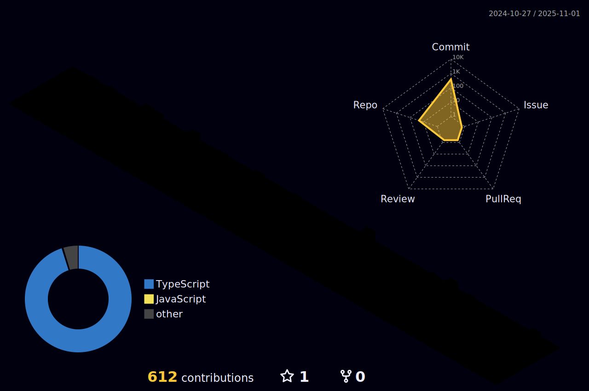

<!--  -->

# Joclelson Rodrigues 👋

Desenvolvedor Full Stack, formado em análise e desenvolvimento de sistemas e T.I a mais de 10 anos.

## 💻 Habilidades

### 👨🏻‍💻 Front-end 📱

### 🗄️ Back-end 🔙🔚

### DevOps

## 🛠 Ferramentas

## 🔗 Conecte-se comigo

<!--  -->
    
    
    
    

## 📊 Github Status

<!-- 

 -->
